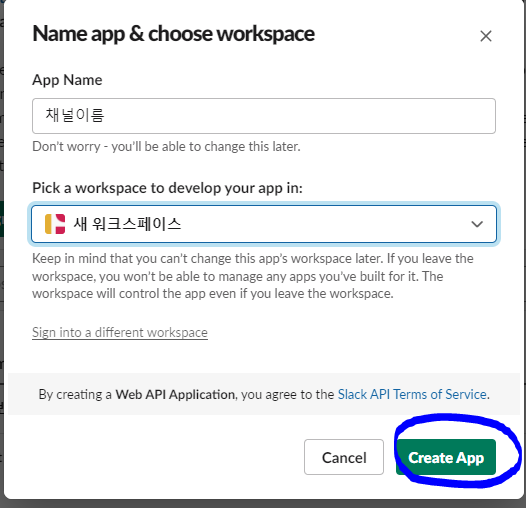
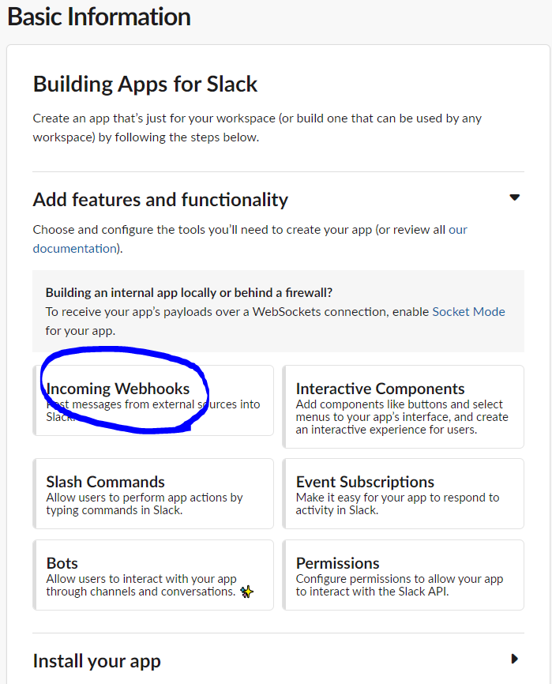
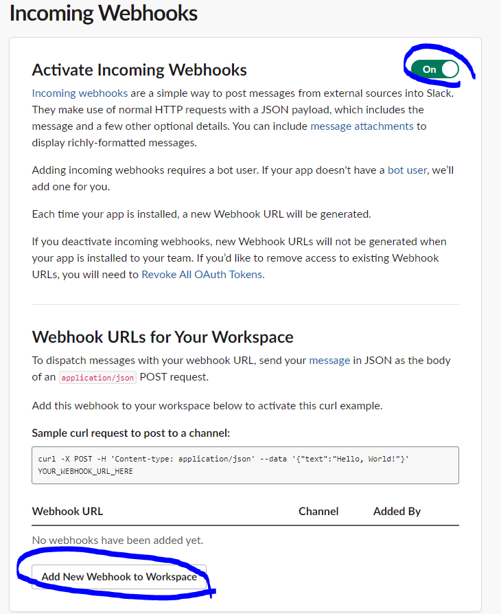
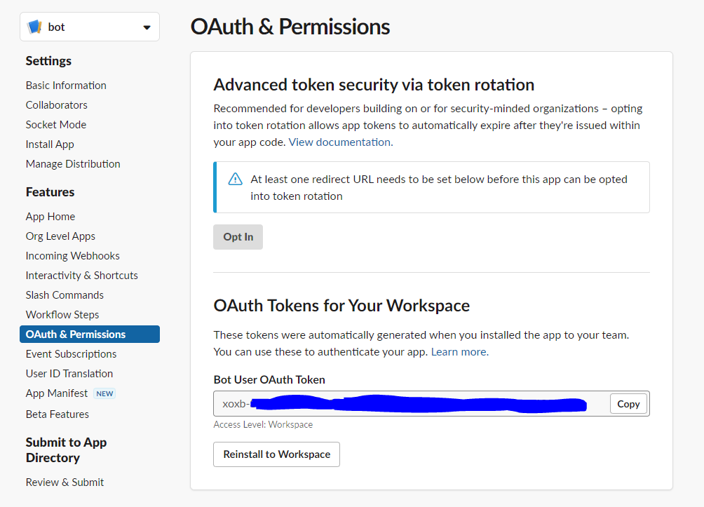
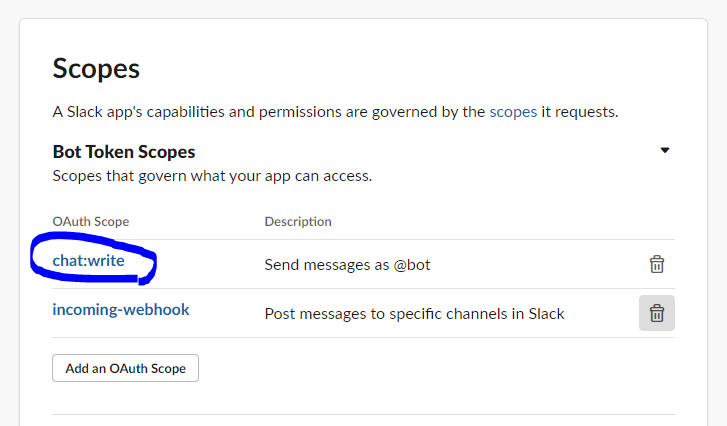

## Slack 이용한 ip 받기

#### SLACK_API_TOKEN 받기














#### IP를 slack에 보내기_코드

```python
#HTTP 클라이언트 라이브러리
import requests
import json

#네트워크
import socket
#gethostbyname함수를 사용해 값 가져오기
def ipcheck(): return socket.gethostbyname(socket.getfqdn())


def post_message(channel, text):
    #토큰
    SLACK_BOT_TOKEN = "xoxb-"
    headers = {
        'Content-Type': 'application/json',
        'Authorization': 'Bearer ' + SLACK_BOT_TOKEN
    }
    payload = {
        'channel': channel,
        'text': text
    }
    r = requests.post('https://slack.com/api/chat.postMessage',
                            headers=headers,
                            data=json.dumps(payload)
                            )


if __name__ == '__main__':
    #text에 ipconfig 함수를 넣음
    post_message("#bot", ipcheck())
```


