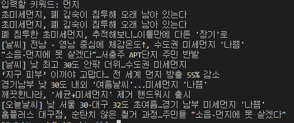

## <span style="color:blue">HTML 구조</span>

##### 태그 이름

| **태그**  |                           **설명**                           | **사용 예**                                                  |
| :-------: | :----------------------------------------------------------: | ------------------------------------------------------------ |
| **h1-h6** |                    제목을 입력할 때 사용                     | <ht> 제일 큰 제목 </ht>                                      |
|   **p**   |                 하나의 문장을 입력할 때 사용                 | <p> 문장 </p>                                                |
|  **div**  | 박스형태의 구역 설정(block 요소) [다른 태그들이 div 안에 모여있게 됌] | <div> <h3>제목</h3><p>문장</p></div>                         |
| **span**  | 줄 형태의 구역 설정(inline 요소)[독립적으로 사용하지 않고 **p** 태그 안에 **span** 태그가 들어감] | <p>이렇게<span style="border: 3px solid red"> span요소로 텍스트의 일부분 </span> 만 스타일을 적용할 수 있음 </p> |
|  **img**  | 이미지와 관련된 태그(속성명은 src, 속성값은 "이미지의 url 주소") 종료태그(/lmg)가 없는 빈 태그(empty tag) |  |
|   **a**   |                 하이퍼링크를 추가할 때 사용                  | <a href="링크주소">HTML링크</a>                              |
|  **ul**   | unordered list: 기호로 된 리스트 li 태그가 하위 태크로 사용되어 내용을 채움 | <ul><li>기호</il></ul>                                       |
|  **ol**   | ordered list : 순서가 있는 리스트 li 태그가 하위 태그로 사용되어 내용을 채움 | <ol><li>1번</li></ol>                                        |


#### ID

- 하나의 웹페이지에서 **하나만 쓸 수 있는 고유한 이름**으로 <태그 이름id="속성값"> 와 같이 쓰임


#### CLASS

- 비슷한 형태를 가진 요소에 **여러 번 사용할 수 있는 이름**으로 <태그이름 class="속성값">와 같이 쓰임 


## <span style="color:blue">CSS 구조</span>

**html** 로 만들어진 것들을 꾸며주는 역할인 **CSS** 이다.


| 분류               | 설명                                        | 예   |
| ------------------ | ------------------------------------------- | ---- |
| 태그 선택          | 특정 태그를 선택                            |      |
| 아이디 선택        | id = '속성값'인 태그를 선택                 |      |
| 클래스 선택        | class='속성값'인 태그를 선택                |      |
| 태그 + 아이디 선택 | 특정 태크 중 id가 '속성값' 인 태그를 선택   |      |
| 태그 + 클래스 선택 | 특정 태크 중 class가 '속성값'인 태그를 선택 |      |


## <span style="color:blue">동적/정적 수집 차이</span>

|                   | 정적 수집                    | 동적 수집                |
| ----------------- | ---------------------------- | ------------------------ |
| **사용 패키지**   | requests / urllib            | selenium                 |
| **수집 커버리지** | 정적 웹 페이지               | 정적/동적 웹 페이지      |
| **수집 속도**     | 빠름(별도 페이지 조작 필요x) | 상대적으로 느림          |
| **파싱 패키지**   | beautifulsoup                | beautifulsoup / selenlum |


```python
#패키지 불러오기
from bs4 import BeautifulSoup
import requests

#크롤링할 url 주소 입력
url1 = "https://search.naver.com/search.naver?where=news&sm=tab_jum&query=코로나"

#매번 다른 키워드를 입력하고 싶을 때 url 주소 + 검색어
query = input('입력할 키워드: ')
url2 = 'https://search.naver.com/search.naver?where=news&sm=tab_jum&query='+'%s'%query

#requests 패키지의 함수를 이용해 url의 html 문서를 가져오기
response = requests.get(url2)
html_text = response.text

#BeautifulSoup패키지의 함수를 이용해서 html 문서를 파싱
soup =  BeautifulSoup(html_text, 'html.parser')

#bs4 패키지의 select_one 함수와 선택자 개념을 이용해서 뉴스기사 제목을 하나 가져오기
print(soup.select_one('a.news_tit').get_text())

#bs4 패키지의 select 함수와 선택자 개념을 이용해서 뉴스기사 제목을 모두 가져오기
titles = soup.select('a.news_tit')

for i in titles:
    title = i.get_text()
    print(title)
```


**url1** 를 이용해서 키워드를 입력하지 않고 엔터를 칠 경우 **url1** 에 있는 것들이 출력된다.





**url2** 를 이용해서 키워드 먼지를 검색할 경우 먼지가 포함된 것들을 출력해준다.


